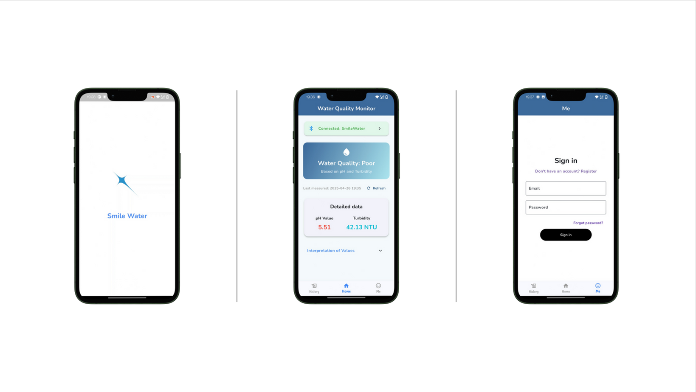
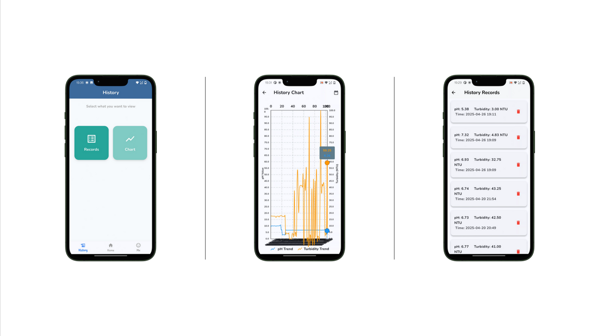

# 💧 Smile Water⭐

## 🤗Introdution

**Hi, Ladies and Gentlemen,boys and girls.** 👋👋👋

**Smile Water💧** is a mobile application designed to assist users in quickly assessing water quality during outdoor activities.  
Whether hiking, camping, or exploring nature, users can connect to the **SmileWater** Bluetooth device to monitor real-time **pH** and **Turbidity** levels, helping them determine whether the water is safe to drink or use.

**Smile Water💧** will take care of your health~!

The app features a simple and intuitive interface that allows users to:
- Connect seamlessly to the SmileWater BLE device.
- Instantly view live pH values and turbidity measurements.
- Access a full history of past measurements.
- Visualize trends over time through interactive charts.
- Filter historical data based on specific date ranges.

> Developed as the final project for CASA0015 Mobile Systems Development.

---

## 🚀 Features

- 📱 Bluetooth connection with **SmileWater** device
- 🌟 Real-time display of pH and turbidity
- 📊 History records list and detailed charts
- 📅 Date range filter for historical data
- 🎨 Clean, intuitive, and vibrant UI
- 🛠 Built using **Flutter**, **Firebase**, and **fl_chart**

---

## 📸 Screenshots

 
 


---
## 🎥 Demo Video


---
## 💻 Landing Page

- 🖱Click here to see the landing page

---

## 🛠 Installation
You have two options to experience the Smile Water app:

### 📥 Method 1: Download APK Directly

- Simply download the APK file from the  [Releases](https://github.com/TTrista/SmileWater/releases)  section on the right sidebar of this GitHub page.
- Install the APK on your Android device.
- Open the app and start monitoring water quality immediately! 🚀

---

### 💡 Method 2: Run via Android Studio (Recommended for Developers)

Follow these steps to set up and run the app manually:
1. Clone this repository:
   ```bash
   git clone https://github.com/TTrista/SmileWater.git
2. Navigate into the project directory:
   ```bash
   cd smile-water
3. Install dependencies:
   ```bash
   flutter pub get
4. Launch the application:
   ```bash
   flutter run
✅ Make sure you have Flutter and Android Studio properly installed before running the app.

---
## 📅 Plugins & Versions

- `cupertino_icons: ^1.0.8`
- `firebase_core: ^3.13.0`
- `firebase_auth: ^5.5.2`
- `cloud_firestore: ^5.6.6`
- `provider: ^6.1.4`
- `firebase_ui_auth: ^1.16.1`
- `fl_chart: ^0.64.0`
- `flutter_launcher_icons: ^0.13.1`
- `flutter_reactive_ble: ^5.0.2`
- `permission_handler: ^11.3.1`
- `intl: ^0.19.0`

*(Check `pubspec.yaml` for the full list)*

---

## 📜 License

This project is licensed under the MIT License. See the [LICENSE](LICENSE) file for details.


---


##  📬 Contact

Created with ❤️ by Trista

Email: zinan.ye02@gmail.com

GitHub: [TTrista](https://github.com/TTrista)